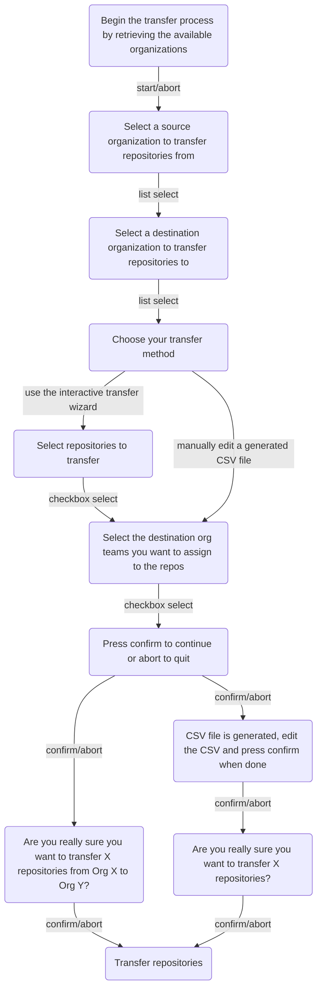

# GitHub Repository Transfer Utility

> A utility to batch transfer GitHub repositories from one organization or user to another.

Transfer repositories using an interactive wizard or manually edit a generated CSV file, including the ability to assign existing teams.


## Usage

### Set Codespaces or `.env` secrets

Set a Personal Access Token either as a Codespaces secret or in a `.env` file when running locally.

| Name    | Value                                               | Required |
| :------ | :-------------------------------------------------- | :------- |
| `TOKEN` | A `repo`, `read:org` scoped [Personal Access Token] | `true`   |

[personal access token]: https://github.com/settings/tokens/new?scopes=repo,read:org&description=Repo+Transfer+Utility 'Personal Access Token'

:bulb: Make sure you're an org owner for both source and destination organizations.

:bulb: Your personal user account will show up first in the list of available organizations.

:bulb: As every repository transfer sends an email to the repository owner, you may want to use a machine user with separate email instead to avoid a full mailbox.

### Codespaces

1. Fork or clone the repository
2. Set your Personal Access Token as a [Codespaces secret](https://docs.github.com/codespaces/managing-codespaces-for-your-organization/managing-encrypted-secrets-for-your-repository-and-organization-for-github-codespaces#adding-secrets-for-a-repository)
3. [Create a codespace for your repository](https://docs.github.com/codespaces/developing-in-codespaces/creating-a-codespace-for-a-repository#creating-a-codespace-for-a-repository)

### Node.js

```sh
mv .env.example .env

npm install
npm start
```

## Flowchart



## CSV Layout (manual mode)

```csv
repo,source org,destination org,[team ids]
```
